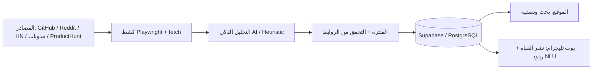

# 🪤 API Hunter AI

منصة متكاملة **وكيل ذكاء اصطناعي لاصطياد مفاتيح الـ API المجانية** + موقع ويب تفاعلي + بوت وقناة تليجرام.

| المكوّن | التقنية |
|---|---|
| 🖥️ الموقع (لوحة التحكم) | Next.js 15 (App Router) + Tailwind CSS + Lucide Icons |
| 🦾 محرك الاصطياد | Node.js/TypeScript + Playwright + OpenAI/Gemini للتحليل |
| 🗄️ قاعدة البيانات | Supabase (PostgreSQL) + Prisma ORM |
| ✈️ البوت والقناة | Telegraf |

---

## 🧱 بنية المشروع (Monorepo)

```
API-HunterAI/
├── apps/
│   ├── web/        # موقع Next.js (لوحة تحكم داكنة + بحث + فلاتر)
│   ├── agent/      # الوكيل: كشط + تحليل ذكي + تحقق + حفظ
│   └── bot/        # بوت تليجرام: نشر القناة + محادثات NLU
└── packages/
    └── db/         # Prisma Schema + عميل البيانات + بيانات بذر
```

---

## 🚀 التثبيت والتشغيل (خطوة بخطوة)

### 0) المتطلبات
- Node.js **>= 18.18** (اختُبر على v24)
- npm أو pnpm
- Docker (اختياري لقاعدة محلية) أو حساب **Supabase** المجاني

### 1) تثبيت الاعتماديات

```bash
npm install
```

### 2) إعداد قاعدة البيانات

**الخيار A - قاعدة محلية عبر Docker:**
```bash
docker compose up -d postgres
```
سيُشغّل PostgreSQL على `localhost:5432` بالمستخدم `apihunter`.

**الخيار B - Supabase السحابي:**
1. أنشئ مشروعاً مجانياً من [supabase.com](https://supabase.com).
2. من `Project Settings → Database → Connection string` انسخ الرابط.
3. ضع `?schema=public` في نهاية الرابط.

ثم انسخ ملف البيئة واملأه:
```bash
copy .env.example .env   # Windows
cp .env.example .env     # Linux/Mac
```
وحّد قيمة `DATABASE_URL` في `.env` (الجذر يقرؤه المحرك والبوت؛ والموقع يقرأ `apps/web/.env`).

توليد عميل Prisma وإنشاء الجداول وبذر البيانات التجريبية:
```bash
npm run db:generate
npm run db:push          # أو npm run db:migrate
npm run db:seed
```

### 3) تشغيل الموقع (لوحة التحكم)

```bash
copy apps\web\.env.example apps\web\.env   # إن لم تعمل بالجذر
npm run dev:web
```
افتح [http://localhost:3000](http://localhost:3000).

> بدون قاعدة بيانات؟ لا مشكلة: الموقع يعرض **البيانات التجريبية** تلقائياً.

### 4) تشغيل محرك الاصطياد (Hunter Agent)

جولة واحدة:
```bash
npm run hunt:once
```

أو وضع الجدولة اليومية (كل `AGENT_SCHEDULE_HOURS` ساعة):
```bash
npm run hunt
```

خيارات إضافية:
```bash
npm run hunt:once -- --sources=github-public-apis,hn-free-api --limit=10 --skip-link-check
```

> **وضعا التحليل:**
> - بدون مفاتيح AI: يعمل المحرك بوضع **Heuristic** (استخراج قواعدي).
> - مع `OPENAI_API_KEY` أو `GEMINI_API_KEY` في `.env`: تحليل ذكي كامل بالـ JSON.

> ⚠️ أول استخدام مع Playwright قد يحتاج تثبيت المتصفح: `npx playwright install chromium`

### 5) تشغيل بوت تليجرام والقناة

1. أنشئ البوت من [@BotFather](https://t.me/BotFather) واحصل على **التوكن**.
2. أنشئ قناة، أضف البوت كمدير فيها، واحصل على معرفها:
   - أرسل رسالة لأي بوت مثل [@userinfobot](https://t.me/userinfobot) لتحصل على `id` الرقمي الموجب.
   - أو استخدم `@RawDataBot` لقراءة `chat.id` الخاص بالقناة.
3. املأ في `.env`:

```env
TELEGRAM_BOT_TOKEN="123456:AAF-..."
TELEGRAM_CHANNEL_ID="123456789"        # أو -100123456789 للخاصة
BOT_POLLING="true"
BOT_CHANNEL_POLL_SECONDS="300"
```

4. شغّل البوت:
```bash
npm run bot
```

الآن:
- 📣 أي خدمة جديدة يكتشفها الوكيل **تُنشر تلقائياً للقناة** خلال دقائق.
- 💬 في المحادثة الخاصة جرّب: `/latest`، `/search gemini`، `/categories`، أو اكتب بحرية:
  - «أريد مفتاح API مجاني للبحث في شبكة الإنترنت»
  - «أعطني أفضل مفتاح لنموذج Gemini»

---

## 🔄 سير العمل الكامل (كيف يعمل النظام)



---

## 🗺️ أوامر البوت

| الأمر | الوظيفة |
|---|---|
| `/start` | رسالة ترحيب + لوحة تصنيفات |
| `/latest` | آخر 3 خدمات مكتشفة |
| `/search <كلمة>` | بحث مباشر بالاسم/الشركة |
| `/categories` | تصفح حسب التصنيف بأزرار |
| رسالة حرة | فهم لغة طبيعية (عربي/إنجليزي) → أفضل 3 نتائج |

---

## ⚠️ ملاحظات قانونية وأخلاقية

- هذه الأداة **تجمع روابط وخطط مجانية معلنة رسمياً** من مواقع المزودين؛ لا تتجاوز أي نظام مصادقة.
- تفاصيل الخطط المجانية **تتغير باستمرار** – الوكيل يعيد الفحص دورياً، لكن تحقق دائماً من صفحة الأسعار الرسمية.
- استخدم المفاتيح ضمن حدود شروط خدمة كل مزود.
- البيانات التجريبية في `packages/db/src/seed-data.ts` للإيضاح فقط.

---

## 📄 أوامر سريعة في جذر المشروع

```bash
npm run dev:web      # تشغيل الموقع
npm run hunt:once    # جولة اصطياد واحدة
npm run hunt         # محرك مجدول
npm run bot          # بوت تليجرام
npm run db:generate  # توليد Prisma Client
npm run db:push      # مزامنة الجداول
npm run db:seed      # إدخال البيانات التجريبية
```